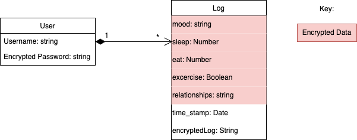
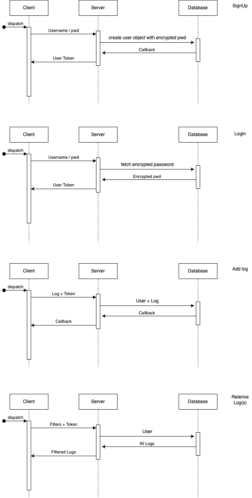

# Inner Bloom Architecture

## 1. Monorepo Structure
The codebase is structured as a monorepo that contains both the frontend and backend code, along with shared utilities and components. This structure allows for easier management of the entire application and helps with code sharing and version control.

### Project Folder Structure:

    root/
        docs/
        packages/
            express-backend/
                models/
                services/
                backend.js
                auth.js
            react-frontend/
                src/
                    assets/
                    fonts/

## 2. Technology Stack

### Frontend (FE)
- **Framework:** React (A popular JavaScript library for building user interfaces, especially single-page applications.)
- **State Management:** (e.g., React Context, Redux) to manage application state across components.
- **UI Libraries:**
  - **Material UI:** Provides pre-built UI components for quick and consistent design.
  - **Chart.js:** For data visualizations like mood, activity, and sleep charts.
  - **React Calendar:** For tracking events, habits, and moods in a calendar format.
- **Styling:** CSS Modules or styled-components for scoped CSS and custom styling.

### Backend (BE)
- **Framework:** Node.js with Express.js (For building the RESTful API that connects the frontend with the database and performs business logic.)
- **Database:** MongoDB
- **Authentication:** JWT
- **APIs:** RESTful API (Endpoints to log moods, activities, meals, etc.)

### Database (DB)
- **Database Type:** MongoDB
- **Schema Design:**
  - **Users:** Store user information, authentication data.
  - **Moods:** Store mood logs, types of moods, timestamp.
  - **Activities:** Logs related to meals, sleep, exercise, and relationships.

## 3. Code Structure (Packages)

### Frontend
- `/src`: Main source code folder
- `/assets`: Includes images for the pages
- `/fonts`: Includes font styles

### Backend
- `/src`: Main source code folder for server-side logic
- `/models`: Define the database schema and models for storing data (e.g., User, Log)
- `backend.js`: Define API endpoints for the frontend to interact with.
- `auth.js`: Custom middleware for tasks like authentication
- `/services`: API communication (GET, POST, PUT, DELETE) and authentication.

## 4. 3rd Party APIs
- **Chart.js:** For rendering charts and visualizations of the user data.
- **React Calendar:** For calendar-based interaction in tracking habits and activities.
- **Authentication:** For user login and signup authentication.
  - **Bcrypt**
  - **Crypto**
  - **Jsonwebtoken**

## 5. UML Class Diagram
*Note: The actual schema for logs is just the timestamp and a string of the encrypted version of the log. This is so we are never storing health data as plain text in our database.*

_Last Updated: [12/04/2024]_

_Last Updated: [11/15/2024]_